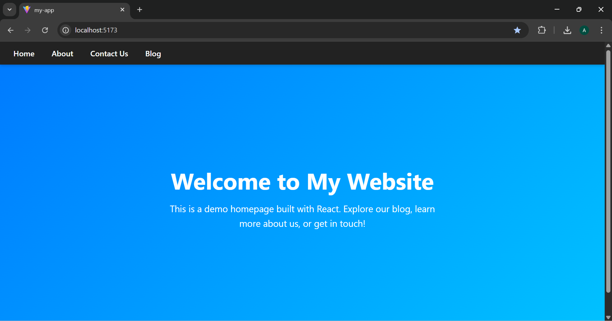
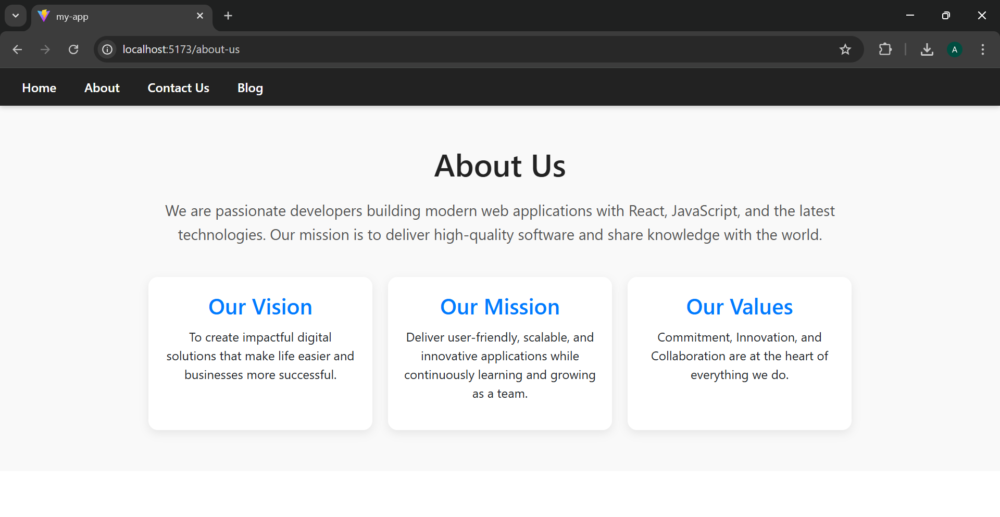
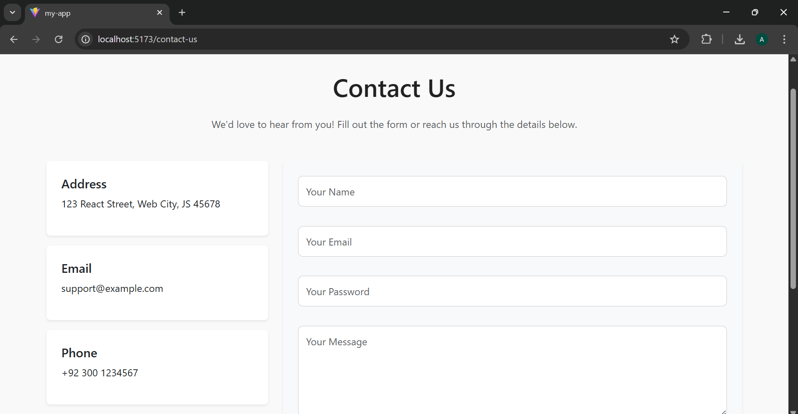
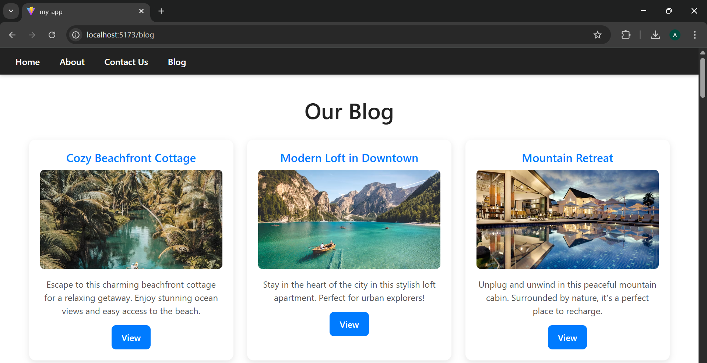

#  React Multi-Page Website

A responsive **React.js** website built with **React Router v6** and **Bootstrap**.  
It includes multiple pages like **Home**, **About**, **Contact Us**, **Blog**, and **Blog Details**, along with error handling for invalid routes.

---

##  Features

-  **Home Page** — Main landing section of the website  
-  **About Page** — Contains information about the website or organization  
-  **Contact Us Page** — Form or contact details for users to reach out  
-  **Blog Page** — Displays a list of blog posts  
-  **Blog Details Page** — Shows details of a selected blog post using dynamic routing  
-  **Error Page** — Handles invalid routes with a user-friendly message  
-  **Bootstrap** — For responsive design and prebuilt components  
-  **React Router DOM** — For client-side routing and navigation  

---
##  Screenshots

###  Homepage  

###  About Section  

###  Contact Section  

###  Posts Section  

##  Technologies Used

- **React.js**
- **React Router DOM**
- **Bootstrap 5**
- **Vite** 

