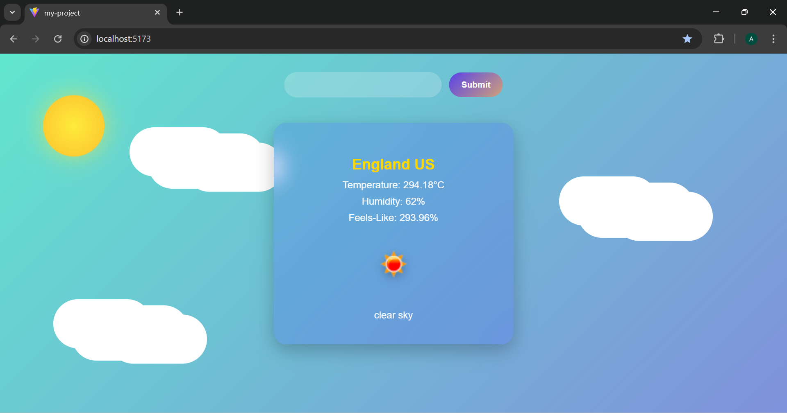

#  Weather App

A simple and interactive **React-based Weather Application** that allows
users to search for current weather details of any city using the
**OpenWeatherMap API**.

This app dynamically displays temperature, humidity, feels-like
temperature, and weather icons with smooth loading and conditional
rendering.

---

### Weather App

##  Features

-  Search weather by **city name**\
-  Displays **temperature**, **humidity**, and **feels-like**
   values\
-  Shows **weather icon** and **description** dynamically\
-  Includes a **loader** during API fetching\
-  Can be extended for **day/night themes**\
-  Built with **React Hooks** (`useState`)

---

##  Technologies Used

  Technology           Purpose

 - React                Frontend framework
 - JavaScript (ES6+)    Logic and functionality
 - CSS3                 Styling and animations
 - OpenWeatherMap API   Fetch live weather data

---

##  Author

**Amna Iftikhar**  
 Built for practice and learning front-end development.
