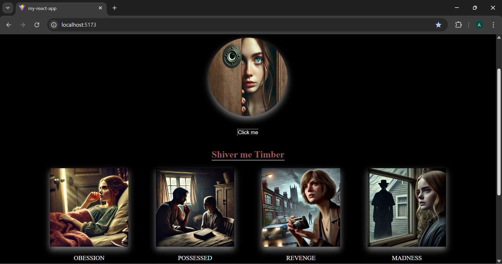
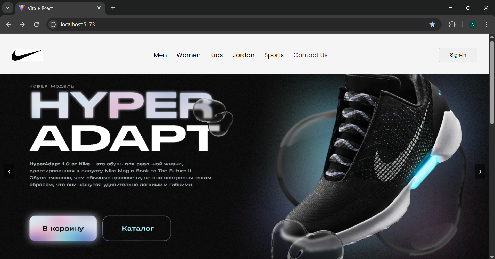
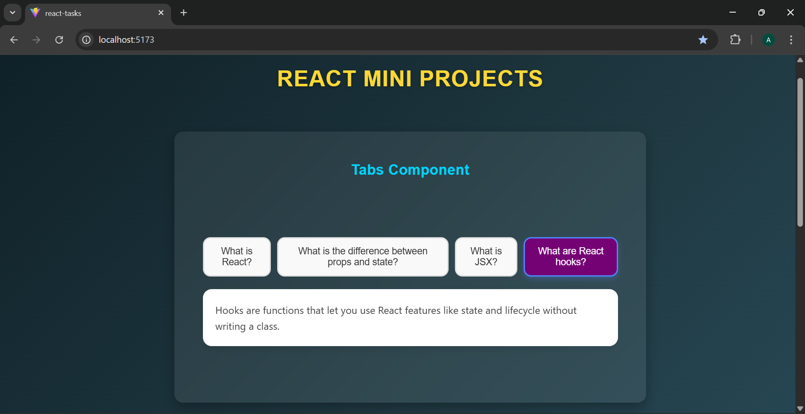
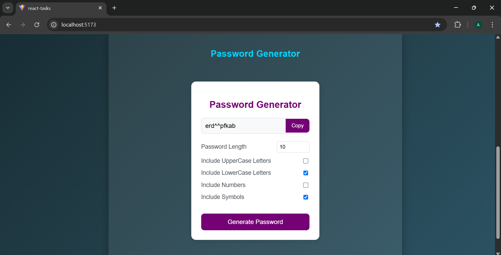

#  React Practice Projects

A collection of my React learning projects — covering fundamentals like components, state, props, routing, forms, and API integrations.

---

##  Project List

###  1. My React App
Basic component-based project practice.

 Folder: [`my-react-app`](./my-react-app)

 Preview:

 ###  Homepage  
 

- [My React App Content](./my-react-app/public/images/Content.png)
---

###  2. React App (with Router & Authentication)
A complete React + React Router project with Navbar, Routes, Login, and Footer.

 Folder: [`react-app`](./react-app)

 Preview:

  ###  Homepage  
 

- [React App Footer](./react-app/public/footer.png)

- [React App Contactus Page](./react-app/public/contact-us.png)

- [React App Form Page](./react-app/public/form.png)
---

###  3. React States
A collection of mini React projects for learning **useState**, **useEffect**, and component logic.

 Folder: [`react-states`](./react-states)

 Preview:
 
  ###  Homepage  
 

- [React States Form](./react-states/public/form.png)
- [React States Lottery](./react-states/public/lottery.png)
- [React States Luddo](./react-states/public/luddo.png)
- [React States TaskManager](./react-states/public/TaskManager.png)

---
###  4. React Tasks
A collection of mini React projects for learning **useState**, **useEffect**, and component logic.

 Folder: [`react-tasks`](./react-tasks/)

 Preview:
 
  ###  Homepage  
 
 
---

###  5. Weather App
Weather App is a simple and responsive web application built with React that allows users to search for real-time weather information of any city. 
 
  Folder: [`Weather App`](./WeatherApp/readme.md)

###  6. Mini Website 
A responsive **React.js** website built with **React Router v6** and **Bootstrap**.  
It includes multiple pages like **Home**, **About**, **Contact Us**, **Blog**, and **Blog Details**, along with error handling for invalid routes.

  Folder: [`Mini Website`](./MiniWebsite/readme.md)

##  Author

**Amna Iftikhar**  
 Built for practice and learning front-end development.

## License
Copyright (c) 2025 Amna Iftikhar. All rights reserved.  
This project is for educational and portfolio purposes only.  
Redistribution or reuse of this code without permission is prohibited.
